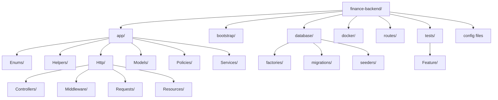
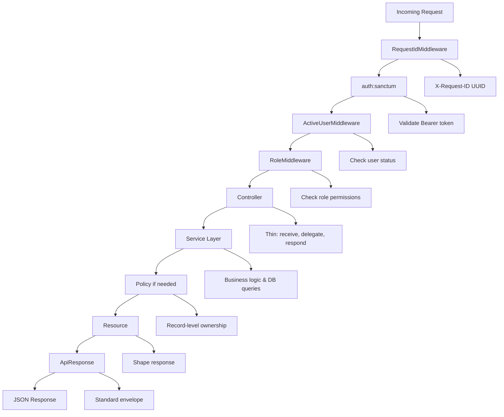

# 💰 Finance Backend API

### _Because someone has to keep track of the money._

<div align="center">

[](https://laravel.com)
[](https://php.net)
[](https://mysql.com)
[](https://docker.com)
[](LICENSE)

</div>

---

## 📖 The Story

> 📊 **Picture this:** A finance team is growing. The analyst needs to pull monthly trends. The manager wants a dashboard. The intern accidentally deleted a record — again. And somehow, everyone has access to everything.

Sound familiar?

That's the problem this project was built to solve.

This is a backend API for a **finance dashboard system** — one where the right people can see the right data, the wrong people hit a polite `403`, deleted records aren't actually gone forever, and every response looks exactly the same no matter which endpoint you hit.

🔒 **No chaos.** 🎯 **No guesswork.** Just clean, role-aware, audit-friendly financial data management.

---

## 🚀 What This Project Does

At its core, this is a **REST API** that lets a finance dashboard:

### 👥 **User Management**

- Three distinct roles — **Viewer**, **Analyst**, and **Admin** — each with clearly enforced permissions
- Role-based access control at both route and record levels

### 💳 **Financial Records**

- Store and manage financial data — income, expenses, categories, dates, notes
- Full CRUD support with **soft deletes** (records are never permanently destroyed)
- Advanced filtering by type, category, date range, or keyword search

### 📊 **Dashboard Analytics**

- Aggregated insights — total income, expenses, net balance
- Monthly trends and category-wise breakdowns
- All powered by **single optimized SQL queries** — no PHP loops, no N+1 problems

### 🔐 **Security First**

- Access control enforced at the **backend level** — not hidden in frontend buttons
- Middleware and policy checks on every request
- Token-based authentication with Laravel Sanctum

It's the kind of backend that a frontend team can plug into and trust completely.

---

## 🛠️ Tech Stack

| Technology      | Version | Why                                                        |
| --------------- | ------- | ---------------------------------------------------------- |
| PHP             | 8.2+    | Enums, readonly properties, modern type system             |
| Laravel         | 11      | Battle-tested, expressive, excellent ecosystem             |
| MySQL           | 8.0     | `DATE_FORMAT`, window functions, reliable decimal handling |
| Laravel Sanctum | Latest  | Token-based auth without OAuth complexity                  |
| PHPUnit         | Latest  | Feature tests that prove behavior, not just coverage       |
| Docker          | Latest  | Consistent environment from dev to production              |
| Render          | —       | Free-tier deployment with native Docker support            |

> 💡 **On the stack choice:** Laravel 11 was chosen not because it's trendy but because it has mature solutions for everything this project needs — form validation, policies, middleware aliases, resource classes, and query scopes — all without reaching for third-party packages. The goal was a clean implementation, not an interesting dependency list.

---

## ✨ Features

### 🔐 **Authentication**

- Register and login with token-based auth via Laravel Sanctum
- Logout revokes the current token only — other sessions stay alive
- Inactive users are blocked even if their token is still valid

### 🛡️ **Role-Based Access Control**

- Three roles: `viewer`, `analyst`, `admin`
- Route-level enforcement via middleware — wrong role never reaches the controller
- Record-level enforcement via Policy — an analyst can only edit their own records
- Admin guards prevent self-demotion and last-admin lockout

### 💼 **Financial Records**

- Full CRUD with input validation on every field
- Soft deletes — records are never permanently destroyed
- Restore deleted records (admin only)
- Filter by type, category, date range, or keyword search
- Pagination on all list endpoints

### 📈 **Dashboard Analytics**

- Total income, total expenses, net balance
- This month's income vs expenses
- Monthly trends for the last N months
- Category-wise breakdown sorted by total
- Recent activity feed
- All powered by single optimized SQL queries — no PHP loops, no N+1

### 👨‍💻 **Developer Experience**

- Consistent JSON response envelope on every single endpoint
- `X-Request-ID` header on every response for request tracing
- Global exception handler — every error type returns the same clean shape
- Postman collection with auto-saving login tokens
- Realistic seed data across 6 months, 10 categories, 4 users

---

## 📁 Project Structure



```
finance-backend/
│
├── app/
│   ├── Enums/                          # Type-safe role and status values
│   │   ├── RoleEnum.php                # viewer | analyst | admin
│   │   └── StatusEnum.php             # active | inactive
│   │
│   ├── Helpers/
│   │   └── ApiResponse.php            # The one class every endpoint uses
│   │
│   ├── Http/
│   │   ├── Controllers/               # Thin — receive, delegate, respond
│   │   │   ├── AuthController.php
│   │   │   ├── DashboardController.php
│   │   │   ├── FinancialRecordController.php
│   │   │   └── UserController.php
│   │   │
│   │   ├── Middleware/                # Gates that run before controllers
│   │   │   ├── ActiveUserMiddleware.php    # Blocks inactive users with valid tokens
│   │   │   ├── RequestIdMiddleware.php     # Attaches X-Request-ID to every response
│   │   │   └── RoleMiddleware.php          # Enforces role access on route groups
│   │   │
│   │   ├── Requests/                  # All validation lives here, nowhere else
│   │   │   ├── FilterRecordsRequest.php
│   │   │   ├── LoginRequest.php
│   │   │   ├── RegisterRequest.php
│   │   │   ├── StoreFinancialRecordRequest.php
│   │   │   ├── StoreUserRequest.php
│   │   │   ├── UpdateFinancialRecordRequest.php
│   │   │   ├── UpdateUserRoleRequest.php
│   │   │   └── UpdateUserStatusRequest.php
│   │   │
│   │   └── Resources/                 # Controls exactly what goes out in responses
│   │       ├── FinancialRecordResource.php
│   │       └── UserResource.php       # Password never appears here — ever
│   │
│   ├── Models/
│   │   ├── FinancialRecord.php        # SoftDeletes + named query scopes
│   │   └── User.php                   # Enum casts, helper methods, relationships
│   │
│   ├── Policies/
│   │   └── FinancialRecordPolicy.php  # Record-level ownership logic
│   │
│   └── Services/                      # All business logic and DB queries live here
│       ├── DashboardService.php       # Aggregation queries — getSummary, getTrends...
│       └── FinancialRecordService.php # Filter, create, update, delete, restore
│
├── bootstrap/
│   └── app.php                        # Middleware registration + global exception handler
│
├── database/
│   ├── factories/
│   │   ├── FinancialRecordFactory.php # Used by tests to spin up records cleanly
│   │   └── UserFactory.php            # Supports .admin(), .analyst(), .inactive() states
│   │
│   ├── migrations/
│   │   ├── 0001_01_01_000000_create_users_table.php
│   │   └── 0001_01_01_000001_create_financial_records_table.php
│   │
│   └── seeders/
│       ├── DatabaseSeeder.php         # Orchestrates the seeding order
│       ├── UserSeeder.php             # 4 users: admin, analyst, viewer, inactive
│       └── FinancialRecordSeeder.php  # 40 realistic records over 6 months
│
├── docker/
│   ├── nginx.conf                     # Nginx config for the container
│   └── supervisord.conf               # Runs nginx + php-fpm together
│
├── routes/
│   └── api.php                        # Route definitions only — zero logic
│
├── tests/
│   └── Feature/
│       ├── AccessControlTest.php      # The one that really matters — proves 403s work
│       ├── AuthTest.php
│       └── DashboardTest.php
│
├── .env.example                       # Safe to commit — no real secrets
├── .gitignore                         # .env is in here, always
├── Dockerfile                         # PHP 8.2 + nginx + supervisor
├── README.md                          # You are here
├── finance-api.postman_collection.json
└── render.yaml                        # Infrastructure as code for Render deployment
```

### 🤔 Why is it structured this way?

The folder structure follows a single rule: **logic lives where it belongs, not where it is convenient.**

- ✅ Validation belongs in `Requests/` — not sprinkled across controller methods
- ✅ Business logic belongs in `Services/` — not buried inside controllers
- ✅ Response shaping belongs in `Resources/` — not hardcoded arrays in each method
- ✅ Access rules belong in `Middleware/` and `Policies/` — not in `if` statements inside controllers

The result is that each file has one clear job. You can find anything in under ten seconds, and changing one thing does not break something three files away.

---

## 🚀 Getting Started

Let's get this running. Should take about five minutes.

### 📋 Prerequisites

Make sure you have these installed:

- PHP 8.2+
- Composer
- MySQL 8.0
- Git

---

### 📥 Step 1 — Clone the repository

```bash
git clone https://github.com/YOUR_USERNAME/finance-backend.git
cd finance-backend
```

---

### 📦 Step 2 — Install PHP dependencies

```bash
composer install
```

---

### ⚙️ Step 3 — Set up your environment file

```bash
cp .env.example .env
```

Now open `.env` and update your database credentials:

```env
DB_DATABASE=finance_backend
DB_USERNAME=your_mysql_user
DB_PASSWORD=your_mysql_password
```

---

### 🔑 Step 4 — Install Laravel Sanctum

Laravel Sanctum provides API token authentication. Install and configure it:

```bash
# Install Sanctum
composer require laravel/sanctum

# Publish Sanctum's migration files
php artisan vendor:publish --provider="Laravel\\Sanctum\\SanctumServiceProvider"

# Run Sanctum migrations (creates personal_access_tokens table)
php artisan migrate
```

> 📝 **Note:** Sanctum creates the `personal_access_tokens` table that stores API tokens. This is essential for the login system to work properly.

---

### 🔐 Step 5 — Generate the application key

```bash
php artisan key:generate
```

> ⚠️ **Security Note:** Laravel uses this key to encrypt sessions and tokens. Never share it. Never commit it.

---

### 🗄️ Step 6 — Create the database

In MySQL, run:

```sql
CREATE DATABASE finance_backend;
```

---

### 🔄 Step 7 — Run migrations and seed data

```bash
php artisan migrate:fresh --seed
```

This creates all tables, seeds 4 users across all roles, and generates 40 realistic financial records spread across the last 6 months.

---

### 🌐 Step 8 — Start the server

```bash
php artisan serve
```

The API is now live at `http://localhost:8000`.

---

### 🧪 Step 9 — Run the tests

```bash
# Run everything
php artisan test

# Run only the access control tests
php artisan test --filter=AccessControlTest
```

---

### 🔐 Default Credentials

| Role                | Email                 | Password |
| ------------------- | --------------------- | -------- |
| 🛡️ Admin            | admin@finance.test    | passadmin |
| 📊 Analyst          | analyst@finance.test  | passanalyst |
| 👁️ Viewer           | viewer@finance.test   | passviewer |
| ⏸️ Inactive Analyst | inactive@finance.test | passinactive |

> 💡 **Testing Tip:** The inactive account exists specifically to prove that a deactivated user with a valid token still gets a `403`. Try it — it should fail, and that failure is the point.

---

### 🛠️ Troubleshooting Sanctum Setup

If you encounter authentication issues, check these common problems:

#### **Missing personal_access_tokens table**

```bash
# Error: "SQLSTATE[42S02]: Base table or view not found: 1146 Table 'personal_access_tokens' doesn't exist"
# Solution: Publish and run Sanctum migrations
php artisan vendor:publish --provider="Laravel\\Sanctum\\SanctumServiceProvider"
php artisan migrate
```

#### **500 error during login**

```bash
# Error: "Call to undefined method Illuminate\\Database\\Eloquent\\Relations\\HasMany::delete()"
# Solution: This happens when Sanctum migrations aren't run
php artisan migrate
```

#### **Token not working**

```bash
# Make sure your User model has the HasApiTokens trait
# Check app/Models/User.php includes:
use Laravel\\Sanctum\\HasApiTokens;
class User extends Authenticatable {
    use HasApiTokens, HasFactory, Notifiable;
}
```

---

## ⚙️ How It Works

### 🔄 The Request Lifecycle

Every request flows through the same pipeline before it ever touches a controller:



---

### Two-Layer Access Control

**Middleware** answers: _Can this role type reach this endpoint at all?_

- Runs before the controller
- Handles broad role restrictions like "only admins can manage users"

**Policy** answers: _Can this specific user act on this specific record?_

- Runs inside the controller
- Handles ownership rules like "an analyst can only update records they created"

Middleware alone cannot know whose record it is. Policy alone would require duplicating role checks in every method. Together they form a clean, non-overlapping two-layer system.

---

### 📊 Dashboard Queries — One Query, Not Ten

The dashboard does not run multiple queries and aggregate in PHP. It runs one SQL query and gets everything in a single round-trip.

The summary endpoint:

```sql
SELECT
  SUM(CASE WHEN type = 'income'  THEN amount ELSE 0 END) AS total_income,
  SUM(CASE WHEN type = 'expense' THEN amount ELSE 0 END) AS total_expenses,
  COUNT(*) AS total_records
FROM financial_records
WHERE deleted_at IS NULL
```

The monthly trends endpoint uses `DATE_FORMAT` with `GROUP BY month, type` — one query returns all months and all types together. The PHP layer only reshapes the result into a frontend-friendly structure. It does no arithmetic.

> 💡 **Performance Note:** Running twelve queries to get twelve months of data when one query returns all twelve is an architectural mistake, not a performance concern. The goal was correctness first.

---

### 🗑️ Soft Deletes

Financial records are never hard-deleted. When an admin hits `DELETE /api/records/{id}`, Laravel sets `deleted_at` to the current timestamp. The record stays in the database.

- Standard queries automatically exclude soft-deleted records
- Admins can view trashed records via `GET /api/records/admin/trashed`
- Admins can restore any record via `POST /api/records/{id}/restore`
- `forceDelete` is explicitly disabled in the Policy — permanent destruction of financial data is not permitted

---

### 📦 Consistent API Response Shape

Every endpoint — success, error, validation failure, 404, 500 — returns this exact structure:

```json
{
    "success": true,
    "message": "Records retrieved successfully.",
    "data": {},
    "meta": {
        "current_page": 1,
        "last_page": 3,
        "per_page": 15,
        "total": 40
    }
}
```

`meta` is only present on paginated list responses. The `success`, `message`, and `data` keys are always there.

This is enforced by the `ApiResponse` helper class and a global exception handler that intercepts every exception type — `ModelNotFoundException`, `AuthorizationException`, `ValidationException`, and the general catch-all — and formats each into this same shape before responding.

---

## 📋 Access Control Matrix

| Action             | Viewer | Analyst | Admin |
| ------------------ | :----: | :-----: | :---: |
| Login / Register   |   ✅   |   ✅    |  ✅   |
| View Records       |   ✅   |   ✅    |  ✅   |
| Create Records     |   ❌   |   ✅    |  ✅   |
| Update Own Records |   ❌   |   ✅    |  ✅   |
| Update Any Record  |   ❌   |   ❌    |  ✅   |
| Delete Records     |   ❌   |   ❌    |  ✅   |
| Restore Records    |   ❌   |   ❌    |  ✅   |
| View Dashboard     |   ❌   |   ✅    |  ✅   |
| Manage Users       |   ❌   |   ❌    |  ✅   |

---

## 🚀 Deployment on Render

This project deploys via Docker on Render using `render.yaml` for infrastructure as code.

### 🌟 Deploy Your Own

```bash
# 1. Push to a public GitHub repository

# 2. Go to render.com → New → Blueprint
#    Connect your GitHub repo — Render detects render.yaml automatically

# 3. After the first deploy, open the Render Shell tab and run:
php artisan migrate --seed

# 4. Update APP_URL in Render environment variables to your deployed URL
```

> 💡 **Free tier note:** Render free web services spin down after 15 minutes of inactivity. The first request after a quiet period may take 30–60 seconds while the container restarts. This is expected on the free plan and would not apply in a paid deployment.

---

## 🔮 Future Improvements

**🚦 Rate Limiting** — Throttle auth endpoints to prevent brute-force attacks. Laravel's built-in `throttle` middleware makes this a ten-minute addition.

**⚡ Redis Caching** — Dashboard queries are read-heavy and change only when records are written. A 5-minute cache with invalidation on record mutations would reduce database load meaningfully at scale.

**📝 Audit Log Table** — A `audit_logs` table recording every mutation: who changed what, when, and what the previous value was. The first thing any compliance team would ask for.

**📄 CSV Export** — `GET /api/records/export?format=csv` with the same filter parameters as the records list. A common finance dashboard requirement.

**🔍 Full-Text Search** — The current search uses `LIKE %keyword%` which scans every row. For large datasets, a MySQL full-text index on `category` and `notes` with `MATCH AGAINST` is the right solution.

**🧪 Broader Test Coverage** — The current tests focus on access control and critical paths. Boundary conditions on validation rules, dashboard aggregation edge cases, and soft-delete restore flows would complete the suite.

---

## 🎯 Closing Note

This project was built with one guiding principle: **every decision should be explainable.**

Not "I used a service layer because that's the pattern," but because it means business logic is reusable from any entry point — HTTP, CLI, queue — and the controller stays independently testable.

Not "I used soft deletes because Laravel supports it," but because financial data should never be permanently destroyed, and `deleted_at` gives a restore path without any schema changes.

Not "I added X-Request-ID because it looks professional," but because when a client reports a bug in production, that UUID in their network tab ties directly to a specific log entry.

Backend engineering is not just about making things work. It is about making things work in a way that the next developer — or future you at 11pm with a production issue — can understand, trust, and extend without fear.

That is what this project tries to be.

---

<div align="center">

_Built with ❤️ using [Laravel 11](https://laravel.com) · [PHP 8.2](https://php.net) · [MySQL 8.0](https://mysql.com) · Deployed on [Render](https://render.com)_

</div>
